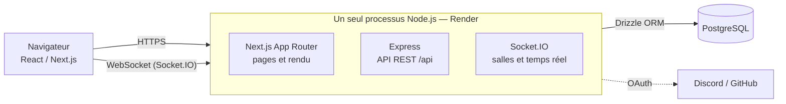
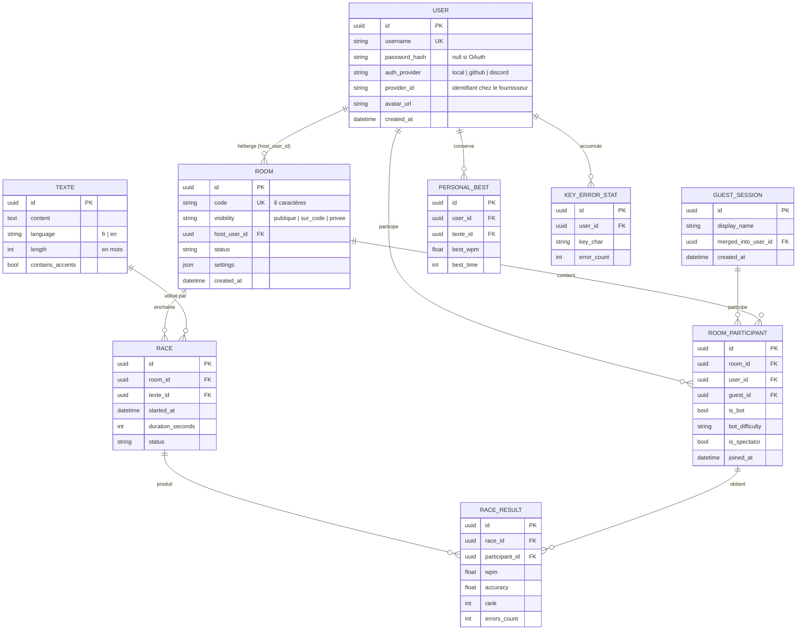
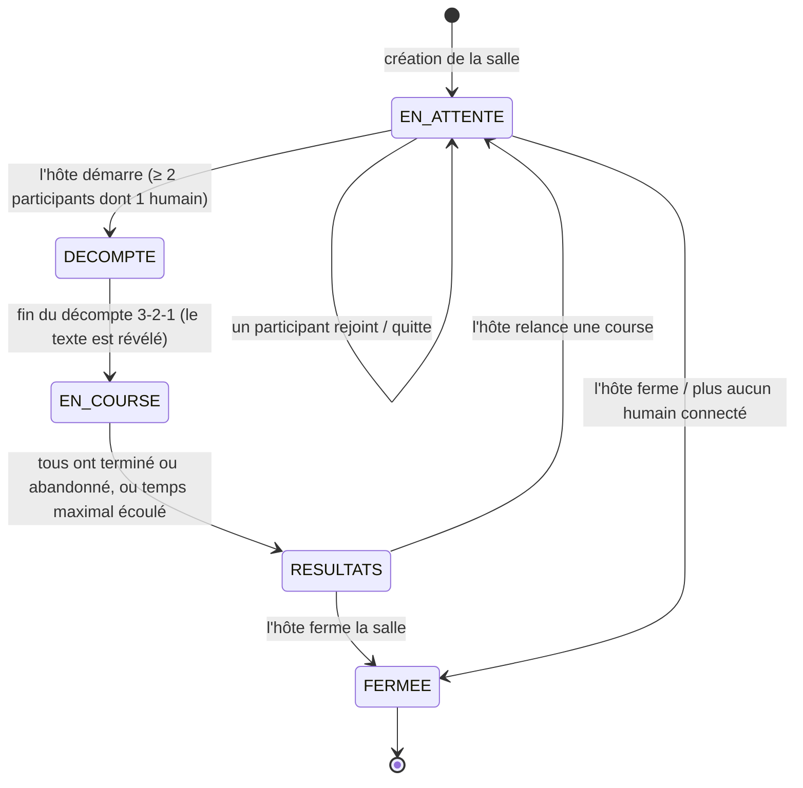
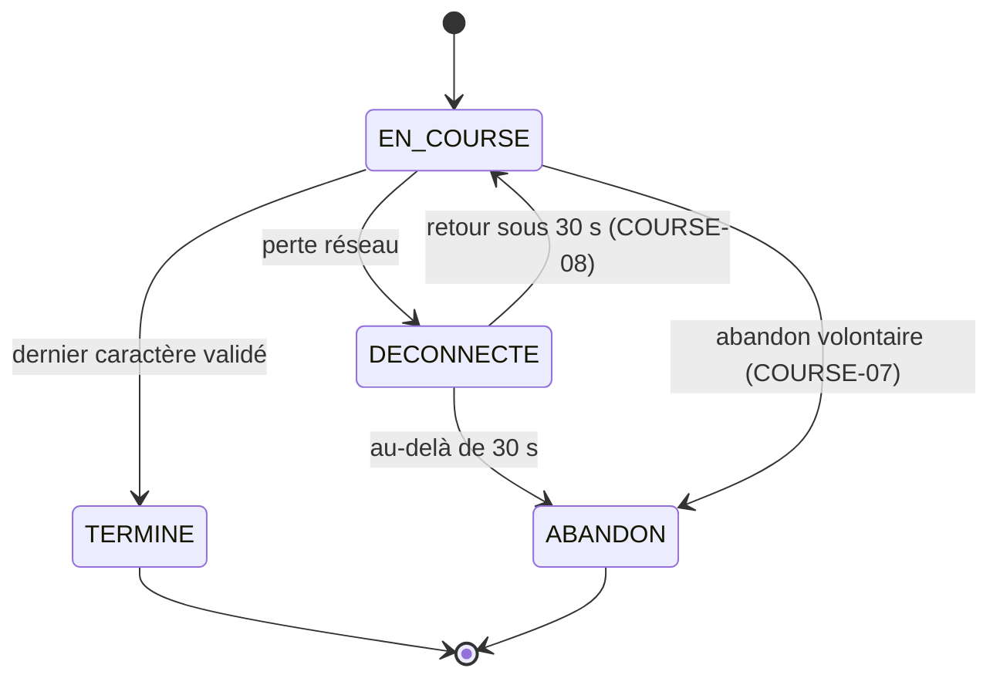

# Architecture — HotKB

Version initiale pour le checkpoint #1. Les éléments **planifiés** (non encore implémentés) sont signalés ainsi : *(planifié)*. Le suivi exigence par exigence est dans [`EXIGENCES.md`](EXIGENCES.md).

## 1. Vue d'ensemble

- **Un seul processus** (`server/src/index.ts`) sert les pages Next.js, l'API REST et Socket.IO sur le même port et la même origine : pas de CORS en production, un seul service à déployer.
- **État de la salle en direct** : en mémoire (`server/src/rooms/handlers.ts`), car il change à chaque événement. **Persistance** en base pour les salles, participants et (bientôt) résultats et historique.
- **Authentification** : jeton JWT (30 jours) obtenu par compte local, invité ou OAuth ; il est aussi vérifié au *handshake* Socket.IO.
- **Validation** : tous les corps de requête et messages temps réel sont validés par des schémas Zod (`server/src/schemas.ts`).

## 2. Modèle de données

Source de vérité : migrations SQL versionnées (`server/migrations/`), reflétées en TypeScript par le schéma Drizzle (`server/src/schema.ts`).

Contrainte clé : un participant est **soit** un utilisateur, **soit** un invité, **soit** un bot (`CHECK one_identity`). *(planifié : contrainte d'unicité « une seule salle active par personne », SALLE-06.)*

## 3. Machine à états d'une course (COURSE-01)

**Implémenté aujourd'hui** : `EN_ATTENTE`, passage à `EN_COURSE` (avec le minimum de 2 participants, vérifié côté serveur et réservé à l'hôte). *(planifié : `DECOMPTE`, `RESULTATS`, `FERMEE` et les transitions associées.)*

Règles d'accès : on ne peut rejoindre qu'en `EN_ATTENTE` (ou `RESULTATS`, planifié), jamais pendant `DECOMPTE`/`EN_COURSE` (SALLE-09).

État d'un participant pendant une course *(planifié)* :

## 4. ADR-001 — Transport temps réel : WebSocket avec Socket.IO

- **Statut** : acceptée.
- **Contexte** : la piste de progression doit se mettre à jour en direct pour tous les participants (COURSE-05), avec un serveur autoritaire (COURSE-06), une tolérance à la déconnexion de 30 s (COURSE-08) et des diffusions d'événements de salle (arrivée d'un joueur, démarrage, bonus).
- **Options** :

| Option | Avantages | Limites pour ce projet |
|---|---|---|
| Polling HTTP | Très simple | Latence visible, charge inutile à haute fréquence |
| Server-Sent Events | Diffusion serveur→client native | Unidirectionnel : il faut un second canal pour envoyer les frappes |
| **WebSocket (Socket.IO)** | Bidirectionnel, faible latence, *rooms* intégrées, reconnexion automatique | Exige un serveur à processus persistant |
| MQTT | Léger, pub/sub | Broker supplémentaire à héberger gratuitement ; pas de notion de salle native |

- **Décision** : **Socket.IO**. Un *room* Socket.IO par salle de jeu, authentification par le même JWT que l'API, reconnexion gérée par la bibliothèque.
- **Conséquences** :
  - Le backend reste un **serveur à processus long** (pas de serverless) ; c'est pourquoi Next.js est servi par un **serveur personnalisé** qui héberge aussi Express et Socket.IO, plutôt que par un déploiement serverless de Next.js.
  - PERF-02 : les mises à jour de progression seront **regroupées ou limitées** (≈ 10 messages/s par joueur au maximum), jamais écrites en base à chaque frappe ; seul le résultat final est persisté.
  - Pour passer à plusieurs instances, il faudrait un adaptateur Redis pour Socket.IO — hors périmètre.

## 5. Flux de messages temps réel

| Événement | Sens | Rôle | État |
|---|---|---|---|
| `room:create` | client → serveur | Crée la salle (utilisateur connecté seulement, AUTH-03) | implémenté |
| `room:join {code}` | client → serveur | Rejoint par code (validé Zod, 10 tentatives/min/IP, SALLE-10) | implémenté |
| `room:start` | client → serveur | Démarre (hôte seulement, ≥ 2 participants) | implémenté |
| `room:leave` | client → serveur | Quitte la salle ; transfert de l'hôte si besoin | implémenté |
| `room:state` | serveur → salle | Diffuse l'état public de la salle (participants, hôte, statut) | implémenté |
| `race:countdown` | serveur → salle | 3-2-1 synchronisé, puis le texte | planifié |
| `race:progress` | client → serveur | Progression (caractères validés), plafonnée en fréquence | planifié |
| `race:positions` | serveur → salle | Positions et MPM de tous (≈ 4 mises à jour/s) | planifié |
| `race:bonus` | serveur → salle | Annonce d'un bonus de remontée | planifié |
| `race:results` | serveur → salle | Résultats finaux, persistés en base | planifié |

Le **serveur est la source de vérité** (COURSE-06) : il fixe les temps de départ et de fin, valide les progressions (rejet des sauts et des vitesses irréalistes) et applique les bonus.

## 6. Approche prévue pour les bots (BOT-01 à BOT-05) *(planifié)*

- **Exécution côté serveur**, dans le même processus : un moteur de simulation par course qui avance à pas fixe (ex. 250 ms), sans client réel. Un bot est un participant (`is_bot = true`) qui apparaît sur la piste comme les autres, clairement étiqueté (BOT-04).
- **Déterministe** (BOT-05) : le moteur reçoit une **graine** (`seed`) et utilise un générateur pseudo-aléatoire à graine (type *mulberry32*), jamais `Math.random()`. Même graine + même texte + même niveau ⇒ même course : testable unitairement.
- **Niveaux** (BOT-01) : MPM visé et taux d'erreur par niveau, ajustables et documentés :

| Niveau | MPM visé | Taux d'erreur |
|---|---|---|
| Noob | 10–20 | ~12 % |
| Débutant | 20–35 | ~8 % |
| Intermédiaire | 35–60 | ~5 % |
| Expert | 70–100 | ~2 % |
| Impossible | 140+ | ~0,5 % |

- **Vitesse variable** (BOT-02) : le MPM instantané oscille autour de la cible (accélérations, hésitations) et ralentit sur les mots longs ou rares.
- **Erreurs** (BOT-03) : à chaque frappe, une erreur survient avec la probabilité du niveau ; elle coûte un temps de correction (mode « correction obligatoire ») ou est simplement comptée (mode « libre »), selon la configuration de la salle.
- **Bonus et malus** : les bots y sont soumis comme les humains (BOT-04).
